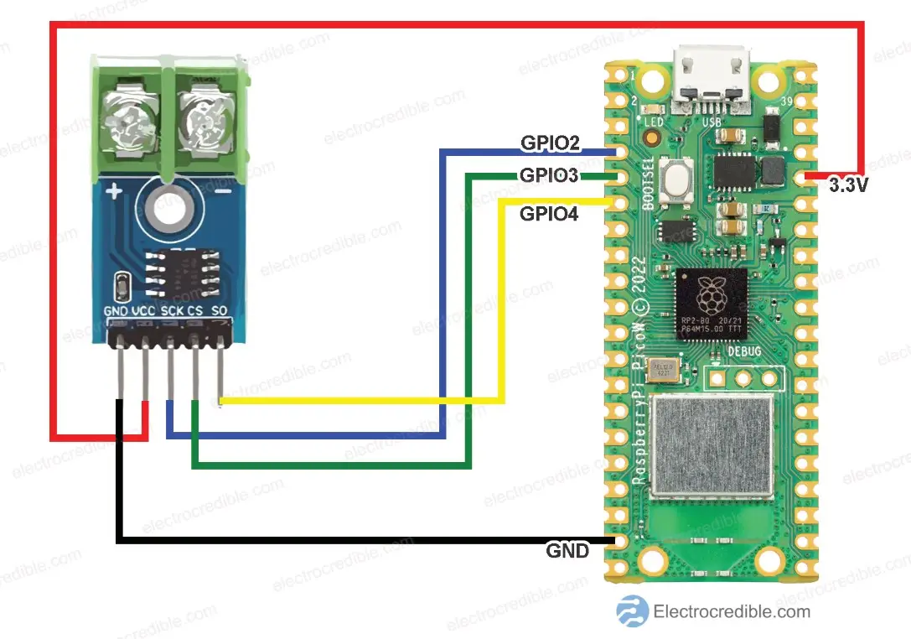

# pico-coffee-roaster-probe

Coffee Thermocouple: Max6675 + Pi Pico 2w Bluetooth to Roastmaster

This sends a Max6675 thermocouple temperature to the [iOS Roastmaster app](https://apps.apple.com/us/app/roastmaster/id375526217) for tracking coffee bean temperature when roasting (roast profiling).

Basic pico 2w implementation of RBP (Roastmaster Bluetooth Protocol): https://rainfroginc.com/wordpress/wp-content/uploads/2021/03/RBP-Data-Sheet.pdf

Influenced by [Electrocredible Tutorial for Max6675](https://electrocredible.com/raspberry-pi-pico-max6675-thermocouple/)

